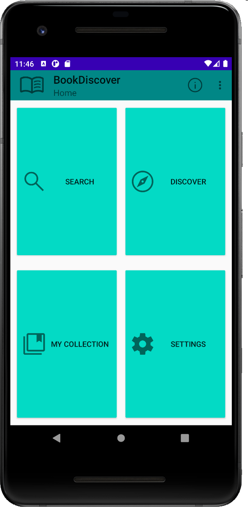
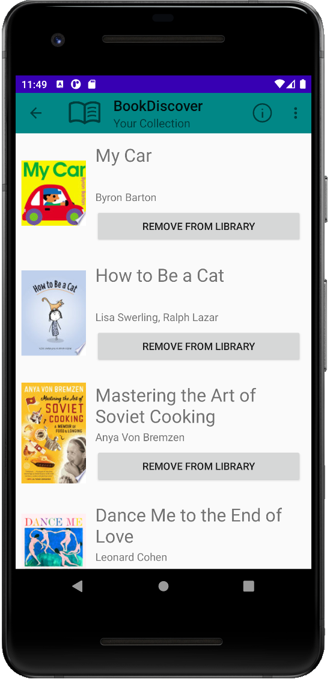
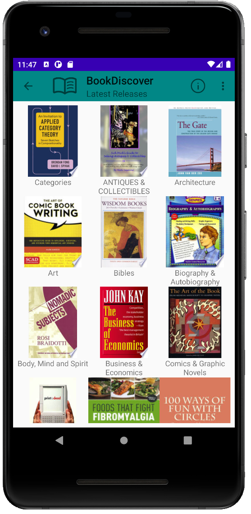
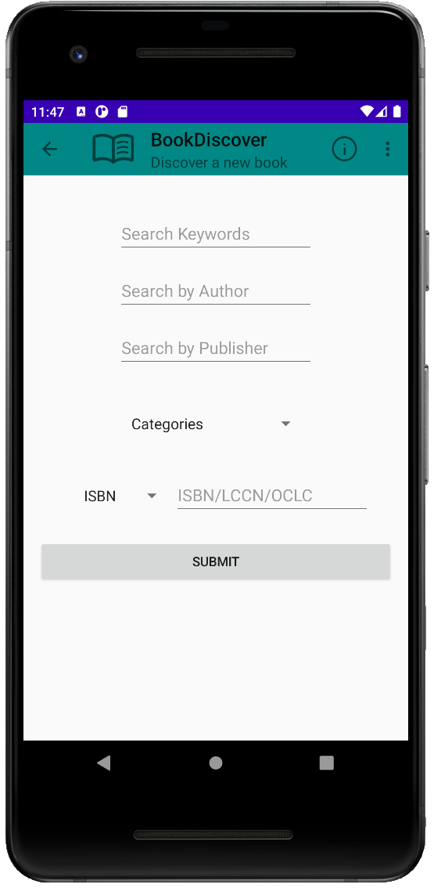
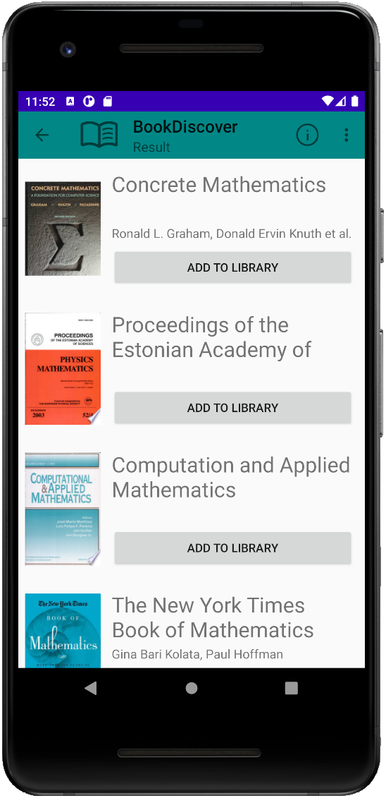
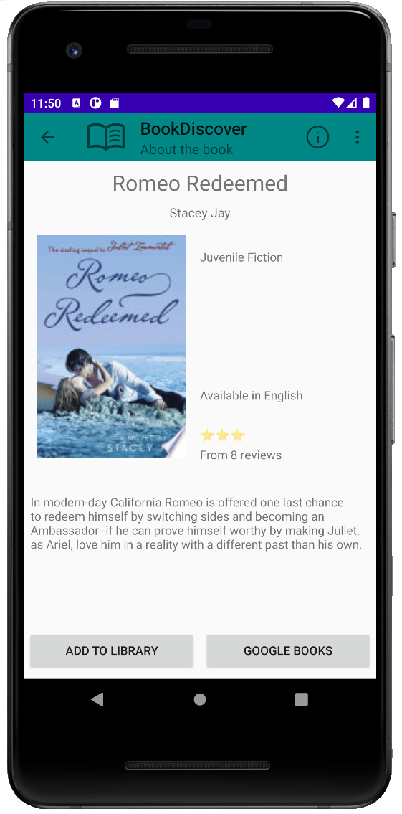

# BookDiscover

Find new books and discover new releases by genres using BookDiscover, powered by Google Books API. 

## Description

Discover millions of books using BookDiscover.

BookDiscover is an app which helps user discover new books and gives users recommendations of books they might like.
Users can look up books using the search filter and save them in their library for future reference..

This project is built with Kotlin with Android's Room Database, RetroFit, Coil and Google Books API.

## Features
- Search for books by name, authors, publishers, categories and more
- Up-to-date information supplied by Google Books API
- Save books for future reference
- Instant access to Google Books website for purchase or further information
- Discover new releases by genres
- And more!
- 

| Home Screen                                                                      | Saved Collections                                                                 | Discover New Releases                                                            |
|----------------------------------------------------------------------------------|-----------------------------------------------------------------------------------|----------------------------------------------------------------------------------|
|    |  |   |

| Search Filter                                                                    | Search Results                                                                    | Detailed Book Information                                                        |
|----------------------------------------------------------------------------------|-----------------------------------------------------------------------------------|----------------------------------------------------------------------------------|
|  |   |  |

### Upcoming Features
- Add more discovery features, such as Weekly Top 100s, Top Author List, Books of the Year etc.
- Share books with friends and family with a click of a button.

## Getting Started

### Dependencies

* Minimum Android SDK version: 21
* Recommended Android SDK version: 31

### Installing

#### For Developers:
1. Fork a copy to your own branch.
2. Use Android Studio or IntelliJ or equivalent IDEs to open the project.
3. Use your IDE's built-in AVD manager and run the app on a virtual device. Note the device requirements are in the dependencies section above.

#### For Common Users (APK To Be Released!):
1. Download the Android APK on the Releases section on GitHub.
2. Install the application by running the APK.

## Help

If you encounter any issues with the app, please close the app and restart it to see if the issue is resolved. If not, please leave a detailed description in the "issues" tab on GitHub to let me know.

## Authors

[Tyler-CY](https://github.com/Tyler-CY)

## Version History

* 1.0
    * Initial Release

## License

This project is licensed under the Tyler-CY License - see the LICENSE.md file for details

## Acknowledgments

* [Official Android Developer Documentation](https://developer.android.com/docs)

